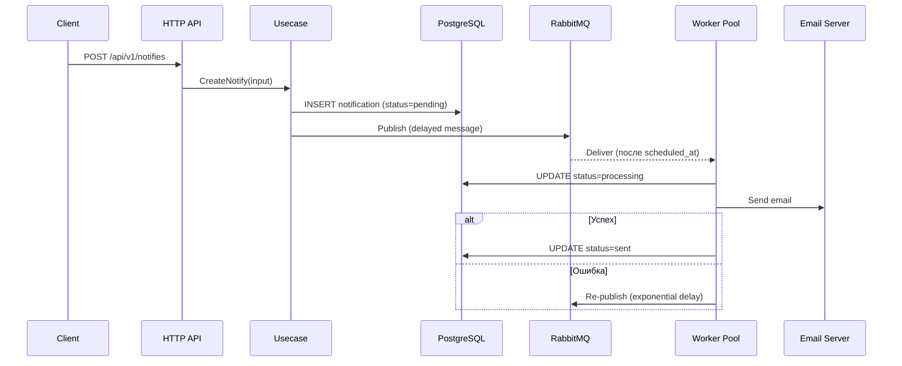

# 📬 Delayed Notifier

> Сервис отложенных email-уведомлений с гарантией доставки, retry-логикой и полным стеком observability.

Учебный pet-проект, демонстрирующий навыки проектирования production-ready микросервиса на Go с использованием Clean Architecture.

---

## 🎯 Что делает сервис

Пользователь планирует отправку email-уведомления на будущее время. Сервис:

1. Принимает запрос через REST API
2. Сохраняет уведомление в PostgreSQL
3. Публикует задачу в RabbitMQ с отложенной доставкой (Delayed Message Exchange)
4. Worker-пул потребляет сообщения и отправляет email через SMTP
5. При ошибке — автоматический retry с экспоненциальным backoff
6. Статус уведомления кешируется в Redis для быстрого чтения

---

## 🛠 Технологии

| Категория       | Технология                                                       |
|-----------------|------------------------------------------------------------------|
| Язык            | Go 1.26                                                          |
| Веб-фреймворк   | Gin                                                              |
| БД              | PostgreSQL (pgx)                                                 |
| Кеш             | Redis                                                            |
| Очередь         | RabbitMQ (Delayed Message Exchange Plugin)                       |
| Email           | net/smtp (STARTTLS / Implicit TLS)                               |
| Observability   | Prometheus + Grafana + Tempo (OpenTelemetry)                     |
| Миграции        | golang-migrate                                                   |
| Конфигурация    | envconfig + godotenv                                             |
| Тесты           | testify (unit + integration)                                     |
| Линтер          | golangci-lint v2 (40+ линтеров)                                  |
| CI quality      | pre-commit (go mod tidy, commitizen)                             |
| Контейнеризация | Docker (multi-stage) + Docker Compose                            |

---

## 📐 Архитектура

Проект построен по принципам **Clean Architecture** с чётким разделением слоёв:

```
cmd/                  → Точка входа (main.go)
internal/
  app/                → Сборка приложения и инъекция зависимостей
  notify/             → Домен "Уведомления"
    domain/           → Бизнес-сущности и правила (Notify, Status, валидация)
    dto/              → Data Transfer Objects (вход/выход API, RabbitMQ payload)
    usecase/          → Бизнес-логика (create, get, delete, get status)
    adapter/          → Реализации портов (postgres, redis, rabbitmq, mailer)
    controller/       → Входные порты
      http_router/    → HTTP-хендлеры (Gin, версионирование v1)
    worker/           → Фоновые воркеры (consumer, publisher, redis writer)
config/               → Загрузка конфигурации из ENV
pkg/                  → Переиспользуемые пакеты
  http/               → HTTP-сервер обёртка
  logger/             → Structured logging (zerolog)
  metrics/            → Prometheus метрики + middleware
  otel/               → OpenTelemetry tracing
  postgres/           → Connection pool обёртка (pgxpool)
  redis/              → Redis-клиент обёртка
  retry/              → Retry с exponential backoff
```

### Поток данных



---

## 🚀 Быстрый старт

### Требования

- Docker и Docker Compose
- Make
- Go 1.26+ (для локальной разработки)

### Запуск всего стека одной командой

```bash
# Клонировать репозиторий
git clone https://github.com/adexcell/delayed-notifier.git
cd delayed-notifier

# Поднять все сервисы (app + postgres + redis + rabbitmq + kafka + observability)
make up

# Применить миграции БД
make migrate-up
```

Сервис будет доступен на `http://localhost:8080`

### Остановка

```bash
make down    # Остановить и удалить все контейнеры и volumes
```

---

## 📡 API

Полная спецификация: [`api/openapi.yaml`](api/openapi.yaml)

### Endpoints

| Метод    | Путь                        | Описание                        |
|----------|-----------------------------|---------------------------------|
| `POST`   | `/api/v1/notifies`          | Создать отложенное уведомление  |
| `GET`    | `/api/v1/notifies/:id`      | Получить уведомление по ID      |
| `GET`    | `/api/v1/notifies/status/:id` | Получить статус уведомления   |
| `DELETE` | `/api/v1/notifies/:id`      | Отменить уведомление            |

### Пример: создание уведомления

```bash
curl -X POST http://localhost:8080/api/v1/notifies \
  -H "Content-Type: application/json" \
  -d '{
    "recipient_email": "user@example.com",
    "subject": "Напоминание о встрече",
    "body": "Не забудьте о встрече в 15:00",
    "scheduled_at": "2026-05-07T15:00:00Z"
  }'
```

**Ответ (201 Created):**

```json
{
  "id": "550e8400-e29b-41d4-a716-446655440000"
}
```

### Пример: проверка статуса

```bash
curl http://localhost:8080/api/v1/notifies/status/550e8400-e29b-41d4-a716-446655440000
```

**Ответ (200 OK):**

```json
{
  "status": "pending"
}
```

### Жизненный цикл статуса

```
pending → processing → sent
   │          │
   │          └──→ pending (retry)
   │
   └──→ cancelled (через DELETE)
```

---

## 🧪 Тестирование

```bash
# Юнит-тесты
make test

# Только юнит-тесты usecase
go test ./internal/notify/usecase/...

# Интеграционные тесты (HTTP + mocks)
go test ./tests/...
```

### Что покрыто тестами

- **Unit**: CreateNotify, GetNotifyStatus, DeleteNotify (usecase-слой с моками)
- **Integration**: HTTP endpoint'ы через `httptest` с полной цепочкой handler → usecase

---

## 📊 Observability

Проект включает полный стек мониторинга, преднастроенный в Docker Compose:

| Сервис     | URL                        | Назначение                    |
|------------|----------------------------|-------------------------------|
| Grafana    | http://localhost:3000       | Дашборды и визуализация       |
| Prometheus | http://localhost:9090       | Сбор метрик                   |
| Tempo      | http://localhost:3200       | Distributed tracing           |

### Метрики (Prometheus)

```
delayed_notifier_notifications_created_total     # Создано уведомлений
delayed_notifier_notifications_processed_total   # Успешно отправлено
delayed_notifier_notifications_failed_total      # Ошибок отправки
```

Метрики доступны по адресу: `GET /metrics`

### Трейсинг (OpenTelemetry → Tempo)

Каждый запрос прослеживается через все слои:
- HTTP middleware → Usecase → Adapter → Worker

---

## 🛡 Ключевые паттерны и решения

| Паттерн / Решение                   | Где используется                                    |
|--------------------------------------|-----------------------------------------------------|
| Clean Architecture                   | Слои domain → usecase → adapter → controller        |
| Dependency Injection                 | `internal/app/notify_domain.go`                     |
| Worker Pool                          | `worker/rabbit_consumer.go` (10 горутин)            |
| Async Writers (fan-out)              | `worker/redis_set.go`, `worker/rabbit_publisher.go` |
| Exponential Backoff Retry            | `pkg/retry/`, `worker/rabbit_consumer.go`           |
| Delayed Message Exchange (RabbitMQ)  | Точная доставка по `scheduled_at`                   |
| Read-through Cache                   | Redis для статуса → fallback на PostgreSQL          |
| Graceful Shutdown                    | Signal handling + drain channels                    |
| Multi-stage Docker Build             | `Dockerfile` (~минимальный Alpine образ)            |
| Database Migrations                  | `golang-migrate` с отдельным контейнером            |
| OpenAPI Spec                         | `api/openapi.yaml`                                  |
| Structured Logging                   | `zerolog` с middleware                              |
| Conventional Commits                 | `commitizen` через pre-commit hook                  |

---

## 🗂 Полная структура проекта

```
.
├── api/
│   └── openapi.yaml              # OpenAPI 3.0 спецификация
├── cmd/
│   └── main.go                   # Точка входа
├── config/
│   └── config.go                 # Загрузка конфигурации из ENV
├── internal/
│   ├── app/
│   │   ├── app.go                # Bootstrap: инициализация и запуск
│   │   └── notify_domain.go      # DI-сборка домена Notify
│   └── notify/
│       ├── adapter/
│       │   ├── mailer/           # SMTP email отправка
│       │   ├── postgres/         # CRUD + статус уведомлений
│       │   ├── rabbitmq/         # RabbitMQ клиент (pub/sub, reconnect)
│       │   └── redis/            # Кеш статусов
│       ├── controller/
│       │   └── http_router/      # Gin HTTP handlers (v1)
│       ├── domain/               # Бизнес-сущности (Notify, Status)
│       ├── dto/                  # DTO (API ↔ usecase ↔ RabbitMQ)
│       ├── usecase/              # Бизнес-логика
│       └── worker/               # Фоновые воркеры
├── migrations/                   # SQL миграции (golang-migrate)
├── observability/
│   ├── grafana/                  # Дашборд + datasources
│   ├── prometheus.yaml           # Конфиг Prometheus
│   └── tempo.yaml                # Конфиг Tempo
├── pkg/                          # Переиспользуемые пакеты
│   ├── http/                     # HTTP server wrapper
│   ├── logger/                   # zerolog + middleware
│   ├── metrics/                  # Prometheus метрики + middleware
│   ├── otel/                     # OpenTelemetry init + middleware
│   ├── postgres/                 # pgxpool wrapper
│   ├── redis/                    # go-redis wrapper
│   └── retry/                    # Retry с exponential backoff
├── tests/                        # Интеграционные тесты
├── web/                          # Фронтенд (HTML/CSS/JS)
├── .env                          # Переменные окружения
├── .golangci.yml                 # Конфигурация линтера
├── .mockery.yml                  # Генерация моков
├── .pre-commit-config.yaml       # Pre-commit хуки
├── docker-compose.yml            # Весь стек инфраструктуры
├── Dockerfile                    # Multi-stage сборка
└── Makefile                      # Команды управления
```


---

## 📋 Makefile-команды

```bash
make help           # Список всех команд
make up             # Поднять все сервисы
make down           # Остановить и очистить
make logs           # Логи всех контейнеров
make ps             # Статус контейнеров
make restart        # Перезапуск app-сервиса

make migrate-up     # Применить миграции
make migrate-down   # Откатить 1 миграцию

make test           # Запуск тестов
make build          # Сборка бинарника в ./bin/
make tidy           # go mod tidy
make fmt            # gofmt

make lint           # Запуск golangci-lint
make lint-fix       # Автофикс линтера
make docker-build   # Сборка Docker-образа
```

---

## 🖥 UI-дашборды

| Сервис           | URL                    |
|------------------|------------------------|
| Приложение       | http://localhost:8080   |
| RabbitMQ UI      | http://localhost:15672  |
| Redis Commander  | http://localhost:8081   |
| Kafka UI         | http://localhost:8082   |
| Grafana          | http://localhost:3000   |
| Prometheus       | http://localhost:9090   |

---

## 📝 Лицензия

Учебный проект. Свободное использование.
